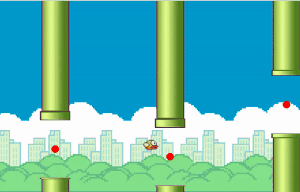

# FlappyBird AI
Implementation of an optimization algorithm (Genetic Algorithm + Neural Nets) to play the Flappy Bird game.

  

## Code execution
The code has two main execution scripts:

* `execute_training.py`: execute training pipeline to play the game. Game parameters and learning algorithm parameters can be edited in `constants.Constants`.
* `main.py`: main script to play the game in three distinct modes:
  * `trained_bird`: watch the trained bird play the game (it is fun! :))
  * `manual`: manual input from the keyboard;
  * `competition`: compete against the trained bird (Human vs AI).
